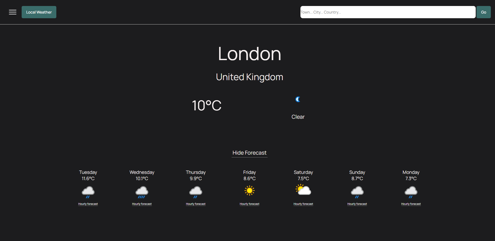
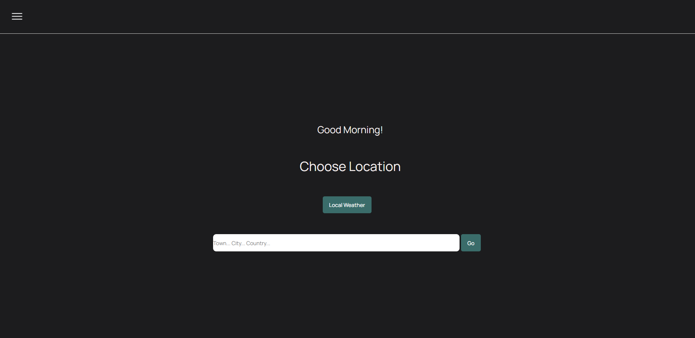
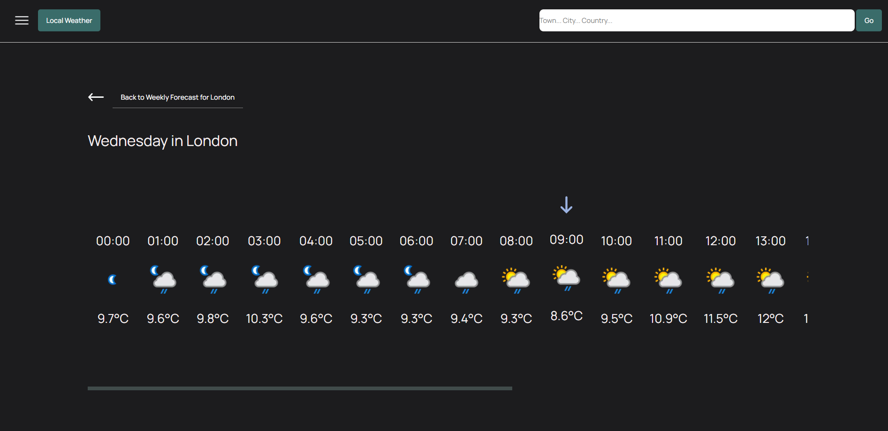

# Weather App

<h1><a href="https://karinhawk.github.io/weather-app/">Visit Website</a></h1>

## Table of Contents
- [About](#about)
- [Screenshots](#screenshots)
- [Languages](#languages)
- [Code of Note](#code_of_note)
- [Bugs to fix](#bugs_to_fix)

---

## About 

A weather app built in React which uses WeatherApi to render weather forecasts for specified locations. The user can check their local weather using their device's coordinates or they can search for a location. A 7 day forecast for a location will be displayed, but a daily forecast can be displayed if a day is clicked on. The user can switch between temperature units (F or C).

---

## Screenshots 

---

## Languages 

- ReactJS
- SCSS

---

## Code of Note 

- useLocation to pass props down via react's Link component
- The hourly forecast shows the user what forecast applies to them in that moment with an arrow
- passing down conditional units
- Using the device's coordinates to pinpoint their local forecast

---

## Bugs to fix 

- Switching between C and F in the modal is not bug-proof

